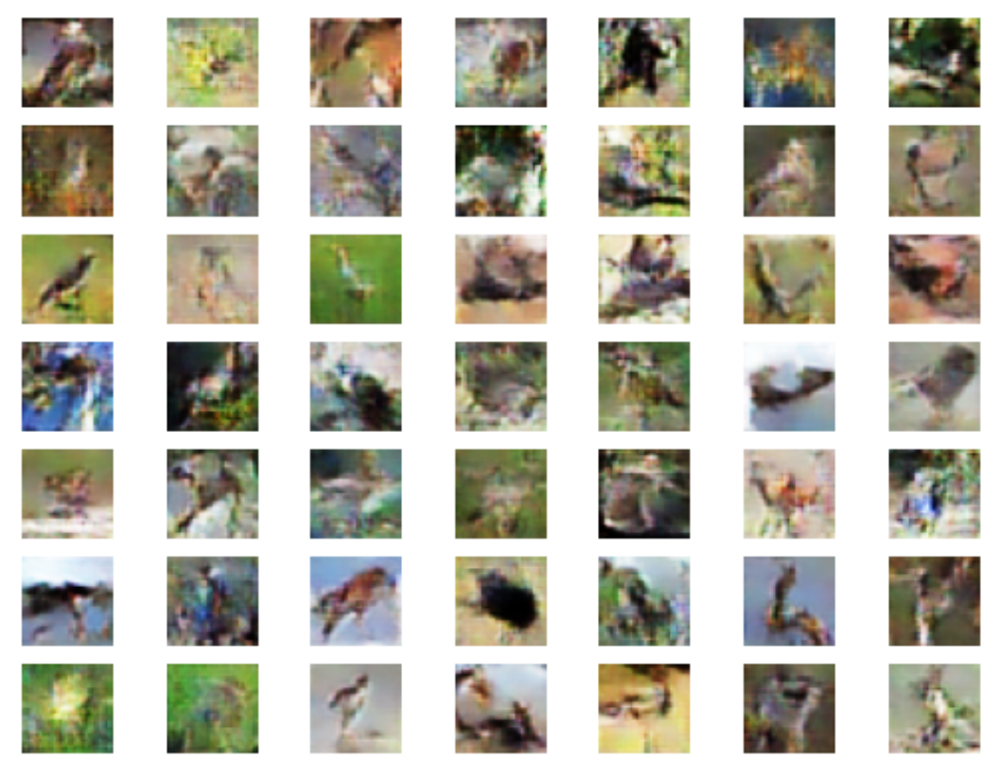
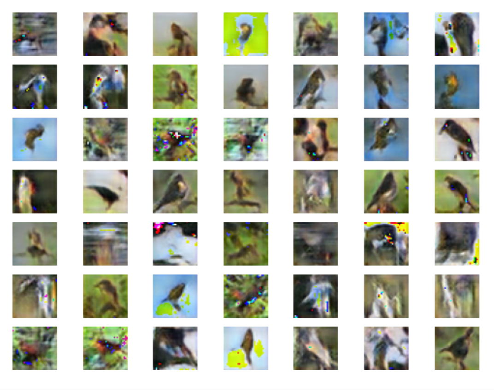

# Single-Class Image Generation on CIFAR-10 using Vanilla GAN and ProGAN

## Overview

This project explores single-class image generation on the CIFAR-10 dataset using Generative Adversarial Networks (GANs) as part of a university course assignment. Two models - a **Vanilla GAN** and a simplified **Progressive Growing GAN (ProGAN)** - were implemented to generate images from a single object class. The code was developed and executed using Google Colab.

## Data

This project uses the CIFAR-10 dataset, consisting of 60,000 32 $\times$ 32 color images across 10 object classes, with 6000 images per class. The dataset is publicly available at: <https://www.cs.toronto.edu/~kriz/cifar.html>

For training the GAN models, only images from the **bird** class were used. Bird images were extracted from both the official training and test sets and merged into a single dataset, as GANs don't require a train–test split. All image pixel values were converted from unsigned integers to float32 for normalization. The pixel values were then normalized to the range [-1,1] to match the *tanh* activation used in the generator's output layer.

## Methods

### Vanilla GAN

> A **Vanilla GAN** consists of a *generator* and a *discriminator* trained simultaneously, where the generator learns to produce realistic samples to fool the discriminator, while the discriminator learns to distinguish real data from samples created by the generator.

The Vanilla GAN's generator was constructed as follows:

-   A sequential model was initialized, with the input defined as a 256-dimensional latent vector.

-   The network consists of a fully connected (FC) layer with 4096 units whose output is reshaped into a 4 $\times$ 4 $\times$ 256 feature map, and three transposed convolutional layers to progressively upsample the feature maps to a resolution of 32 $\times$ 32 pixels. Leaky ReLU activation with $\alpha$ = 0.2 is used throughout the network. All transposed convolutional layers use 3 $\times$ 3 kernels, with the number of filters decreasing across layers (128, 64, and 32).

-   The output layer is defined as a convolution layer with 3 filters, 5 $\times$ 5 kernels and tanh activation, generating an RGB image.

The Vanilla GAN's discriminator was constructed as follows:

-   A sequential model was initialized, with the input defined as an RGB image of size 32 $\times$ 32 pixels.

-   The network consists of 5 convolutional layers for feature extraction, with increasing numbers of filters (16, 32, 64, 128, and 256). All convolutional layers use 3 $\times$ 3 kernels with Leaky ReLU activation ($\alpha$ = 0.2).

-   The extracted feature maps are flattened using a flatten layer and passed to a dropout layer with a dropout rate of 0.5.

-   Finally, the output layer is defined as a FC layer with 1 unit and sigmoid activation.

The resulting model was trained using the Adam optimizer with a learning rate of 0.0001 and $\beta_{1}$ of 0.5, together with Binary Cross-Entropy loss. Training was performed with a batch size of 128 for 500 epochs. Model performance was monitored using the generator loss, the discriminator loss on real samples, and the discriminator loss on generated samples across all training iterations. The generator is trained using random latent vectors and receives no direct access to real images; instead, it is updated based on feedback from the discriminator. Meanwhile, the discriminator is trained on both real and generated images, and is updated based on its ability to correctly distinguish real images from generated ones.

### ProGAN

> **ProGAN** improves the training stability and image quality of Vanilla GAN by progressively growing the generator and discriminator, starting from low-resolution images and gradually increasing the resolution during training.

Training for ProGAN starts at a low resolution of 4 $\times$ 4 pixels and gradually increases to a resolution of 32 $\times$ 32 pixels. The generator and discriminator grow together, so they always operate at the same resolution. New layers are smoothly added using fade-in transition phases. During the fade-in phase, a portion of the generator and discriminator operates at a lower resolution while the newly introduced layers are gradually scaled up, in order to reduce the risk of instability when moving to higher resolutions.

The simplified ProGAN's generator was constructed as follows:

-   The generator's input is defined as a 256-dimensional latent vector.

-   The generator progressively grows its architecture to generate images at increasing resolutions (4 $\times$ 4, 8 $\times$ 8, 16 $\times$ 16, and 32 $\times$ 32).

-   At the base resolution (4 $\times$ 4):

    -   The network consists of a FC layer with 4096 units whose output is reshaped into a 4 $\times$ 4 $\times$ 256 feature map, and 2 convolutional layers with number of filters set to 128 and 64 respectively. Both convolutional layers use 3 $\times$ 3 kernels with Leaky ReLU activation ($\alpha$ = 0.2).

    -   The output layer is defined as a convolutional layer with 3 filters, 1 $\times$ 1 kernels and tanh activation, generating an RGB image.

-   For each subsequent resolution:

    -   A new convolutional block is added to the generator.

    -   The block consists of an upsampling layer that doubles the resolution, and 2 convolutional layers with number of filters set to 128 and 64 respectively. Both convolutional layers use 3 $\times$ 3 kernels with Leaky ReLU activation ($\alpha$ = 0.2).

    -   The output layer is defined as a convolutional layer with 3 filters and 1 $\times$ 1 kernels, generating an RGB image.

-   During resolution transitions:

    -   Two outputs are produced: one from the upsampled previous resolution and one from the newly added layers.

    -   During the fade-in training phase, these two outputs are merged using a weighted sum, allowing a smooth transition between resolutions.

    -   After the fade-in training phase, only the output from the newly added layers is used for the normal (straight-through) training phase.

The simplified ProGAN's discriminator was constructed as follows:

-   The discriminator progressively grows its architecture to discriminate real images from generated ones at increasing resolutions (4 $\times$ 4, 8 $\times$ 8, 16 $\times$ 16, and 32 $\times$ 32).

-   At the base resolution (4 $\times$ 4):

    -   The discriminator's input is defined as an RGB image at 4 $\times$ 4 pixels resolution.

    -   The network consists of 3 convolutional layers for feature extraction, with increasing numbers of filters (64, 128, and 256). The first convolutional layer use 1 $\times$ 1 kernel, while the other two use 3 $\times$ 3 kernels. Leaky ReLU activation with $\alpha$ = 0.2 is applied throughout the network.

    -   The extracted feature maps are flattened using a flatten layer and passed to a dropout layer with a dropout rate of 0.5.

    -   Finally, the output layer is defined as a FC layer with 1 unit and sigmoid activation.

-   For each subsequent resolution:

    -   The discriminator's input resolution is doubled.

    -   A new convolutional block is added to the discriminator.

    -   The block consists of 3 convolutional layers with number of filters set to 64, 128, and 64 respectively, followed by an average pooling layer for downsampling. Leaky ReLU activation with $\alpha$ = 0.2 is applied throughout the network. The first convolutional layer use 1 $\times$ 1 kernel, while the other two use 3 $\times$ 3 kernels.

-   During resolution transitions:

    -   Two input paths are used: one corresponding to the downsampled input from the previous resolution and one processed through the newly added layers.

    -   During the fade-in training phase, the outputs of these two paths are merged using a weighted sum, enabling a smooth transition between resolutions.

    -   After the fade-in training phase, only the path through the newly added layers is retained for the normal (straight-through) training phase.

The resulting model was trained using the Adam optimizer with a learning rate of 0.0001 and $\beta_{1}$ = 0.5, together with Binary Cross-Entropy loss. Training was conducted progressively across 4 growth stages: 4 $\times$ 4, 8 $\times$ 8, 16 $\times$ 16, and 32 $\times$ 32, using a series of normal and fade-in training phases. A batch size of 128 was used throughout training. The number of epochs for the 4 growth stages were set to 30, 40, 50, and 60, respectively. Model performance was monitored using the generator loss, the discriminator loss on real samples, and the discriminator loss on generated samples across all training iterations. In addition, loss values were recorded separately for the normal and fade-in training phases.

As in the Vanilla GAN setup, the generator was trained using random latent vectors and received no direct access to real images; instead, it was updated based on feedback from the discriminator. The discriminator was trained on both real and generated images, and updated based on its ability to correctly distinguish real images from generated ones at each resolution stage.

## Results

### Vanilla GAN

The Vanilla GAN was able to learn basic visual features of the bird class after sufficient training. Generated images showed correct color distribution but noticeable blurriness. While the generator was able to capture the general structure of the bird images, finer details were still weak due to the instability of standard GAN training at a fixed resolution.

### ProGAN

The ProGAN producedhigher-quality images, with sharper edges and clearer bird shapes, compared to the Vanilla GAN. This is because the progressive growing nature of ProGAN allows the model to first learn the overall structure before filling in the finer details, which results in a more stable training behavior. However, there are visible artifacts present in several generated images, indicating further architectural tuning may be needed.

## References

[1] Wang, Z., She, Q., & Ward, T. E. (2021). Generative Adversarial Networks in Computer Vision: A Survey and Taxonomy. *ACM Computing Surveys (CSUR)*, *54*(2), 1-38. <https://doi.org/10.1145/3439723>

[2] <https://machinelearningmastery.com/how-to-train-a-progressive-growing-gan-in-keras-for-synthesizing-faces/>
